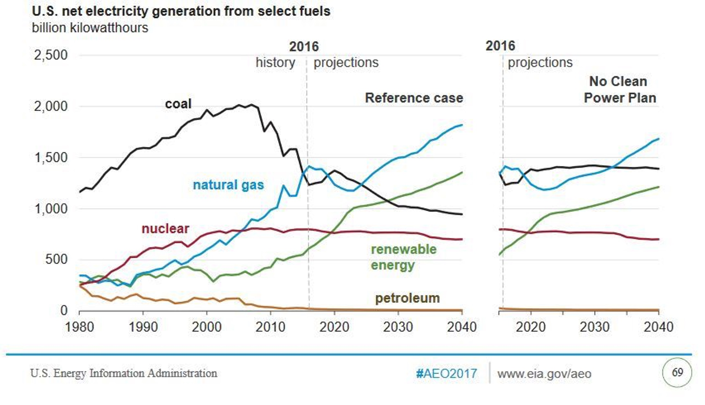
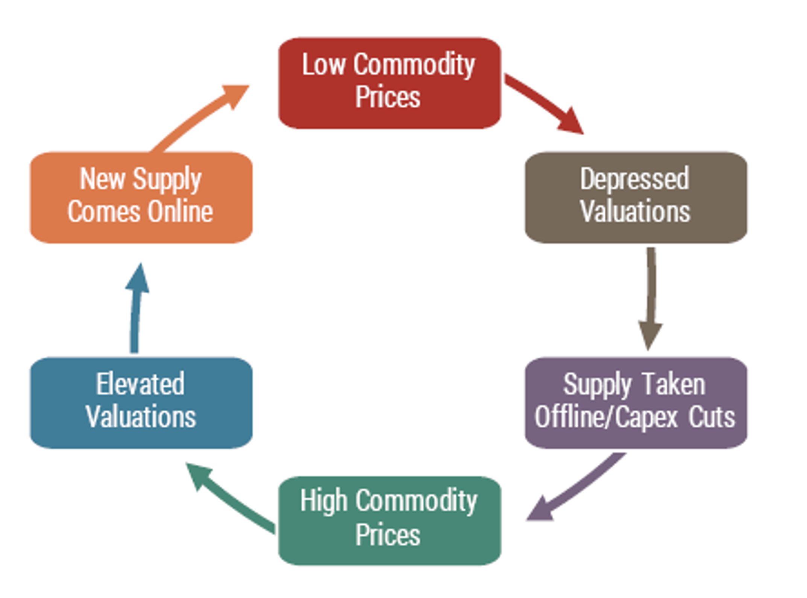
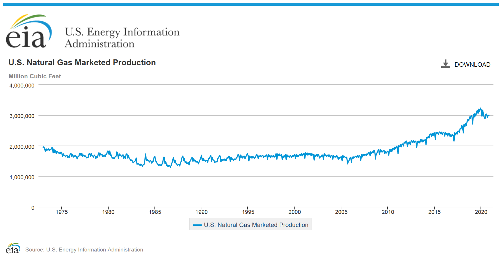
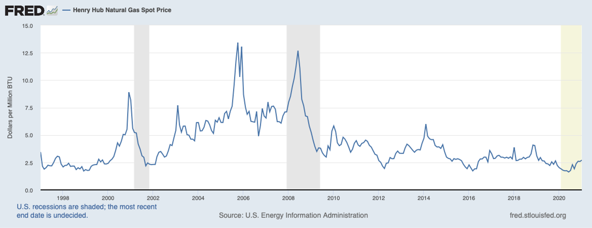
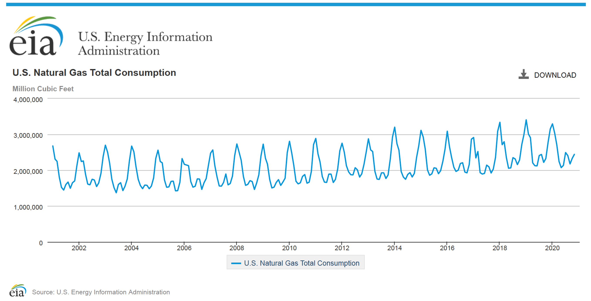
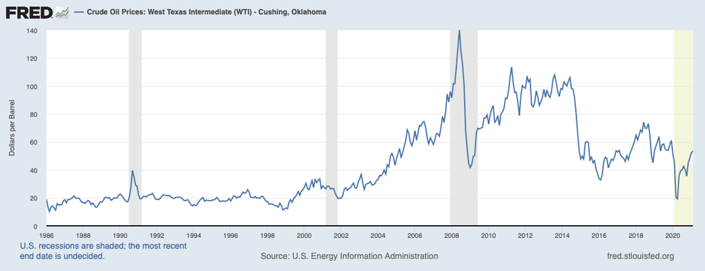

*Note: I wrote this piece before I had this site up and running. I edited it for clarity and published it on November 5, 2021. I often create documents like this one before making investments. It helps me act less impulsively and learn from my mistakes. About a week after I wrote this piece, unusually cold weather knocked out [half](https://www.reuters.com/article/idUSKBN2AF066) of all wind power in Texas, the top wind-energy producing state, while electricity demand rose for heating homes.*

---

 

**Summary:** Invest with margin in US natural gas producers and pipeline operators that have high dividend yields and a consistent dividend history. Investment timeline: 2+ years.

#### Natural Gas isn’t going anywhere

Barring technological breakthrough in energy storage, intermittent energy producers such as solar and wind will be inadequate as a primary energy source. Fossil fuels will still be required to properly power the US electric grid. All things considered, natural gas is cleaner to burn than oil or coal. In a logical world it will prove to be the preferred fossil fuel.

#### US electricity demand will increase significantly & natural gas will fill the gap

As the US transitions to electric vehicles, total US electricity demand will increase as crude demand decreases, unless crude is once again burned for electricity generation. Furthermore, I think that estimates for the adoption rate of renewables are probably too optimistic. With coal currently in decline due to extraction and regulation costs, and with oil production likely to decline in the more distant future, natural gas will directly fill the supply gap created by lower coal production for electric power and will indirectly fill the supply gap created by lower oil production. When offshore (and onshore, to some extent) oil wells are shuttered it will tighten the supply of natural gas, causing short term upward pressure on gas prices that will increase natural gas producers’ valuations. This upward pressure may be negated by increased supply from onshore fracking.

Figure 1: Natural gas is poised to steal market share from coal, aided by clean-power policies.

#### The Biden Administration’s executive actions will increase natural gas prices

In the short term (5 years) the risk of significant increases in the rollout of renewable energy production is low. The Biden administration's plans to ban drilling on federal lands and cancel pipeline construction will constrain supply and cause natural gas prices to increase. This will be good for natural gas producers' valuations. Secretary of the Interior Deb Haaland may extend Biden’s [temporary ban](https://www.spglobal.com/platts/en/market-insights/latest-news/oil/012121-us-puts-new-oil-and-gas-leases-permits-on-federal-lands-on-hold-for-60-days) on fossil fuel leasing on federal lands. Regardless, these bans do not revoke current leases, which last 3-4 years for onshore and 7-10 years for offshore, meaning many leases may outlive the Biden administration. Note that the Secretary of energy Jennifer Granholm does not appear hostile toward natural gas. Also note: an extra cautious investing strategy would focus on producers and pipelines that do not have significant reliance on federal lands. Only around a [quarter](https://www.instituteforenergyresearch.org/fossil-fuels/oil-and-gas-production-on-federal-land-falls-far-below-historic-norms/) of US oil and gas production comes from federal lands.

#### Oil and Gas stocks have relatively low valuations

Assuming a return to profitability for many oil and gas producers by the end of 2021, valuations in the sector are significantly lower than the market as a whole following the economic toll of the coronavirus pandemic. I believe valuations may also be artificially depressed by anti-fossil-fuel-industry sentiment among investors, the general public, and the Democratic Party, which holds the Presidency and majority power in both chambers of congress.

#### Investment in natural gas exploration has stalled

Since the beginning of the pandemic, and possibly as early as 2014 (natural gas prices have been considerably lower since then), producers have shifted capital from exploration to paying down debt and returning to free cash flow generation. This is happening as OPEC+ is simultaneously propping up prices by cutting production.

Figure 2: The investment cycle for commodities industries. The oil & gas industry is experiencing depressed valuations and has reduced supply and capital expenditures.

#### Now is a good time to own wealth-producing debt

The Fed has explicitly stated its heightened tolerance for inflation in coming years. It has also dropped its use of explicit inflation targets. I believe the purpose of this is to reduce the US debt in real terms. The Fed utilized the same strategy after WWII, called [financial repression](https://en.wikipedia.org/wiki/Financial_repression#Examples).

---

 

## Charts

 

Figure 3: US production of natural gas over time. Production picked up in the late 2000's with the fracking boom. Production fell in early 2020.

Figure 4: US natural gas prices over time. Prices were falling before global COVID-19 lockdowns began and have recovered somewhat since then.

Figure 5: US natural gas consumption over time. The COVID-19 pandemic does not seem to have had a discernable effect on natural gas consumption.

Figure 6: US oil prices over time. The pandemic's effect on oil prices is more clear than its effect on natural gas prices. Many oil wells also produce natural gas. When prices fall and oil wells are closed, some natural gas production comes off line too.

---

 

## Other notes

 

#### Upside potential

* The Biden admin takes an explicitly softer tact toward natural gas, including it in its energy transition plans and communicating to the public why natural gas is a preferable fossil fuel energy source
* The EU takes a more explicit stance in favor of natural gas as a transitional fuel
* More use of natural gas as [vehicle fuel](https://www.reuters.com/article/us-amazon-engines-natural-gas-exclusive-idUSKBN2A52ML).

#### Downside potential

* Technological breakthrough in energy storage that makes renewables more competitive
* Common sense deregulation of nuclear energy
* Company-specific meltdown due to poor management, unforeseen liabilities, or other factors
* Market-wide meltdown
* Biden administration takes a more hostile tact toward natural gas

#### Investment criteria

* Minimum of three natural gas companies focused on production or pipelines
* Cumulative dividend payments cover margin costs (Current margin rates are between 1.5% and 4% compounded daily)
* All three companies do not need to pay a dividend

#### Bonus criteria

* Companies that are focused on Marcellus shale as it is not on federal lands and would require state-wide bans on fracking (see New York state) or action by congress (unlikely) in order to ban or tax fracking in a way that will significantly hurt producers.
* Texas, Oklahoma, Arkansas, and Louisiana shale should also be good for the same reasons. Barnett shale in Texas is not on federal land. In New Mexico it is.
